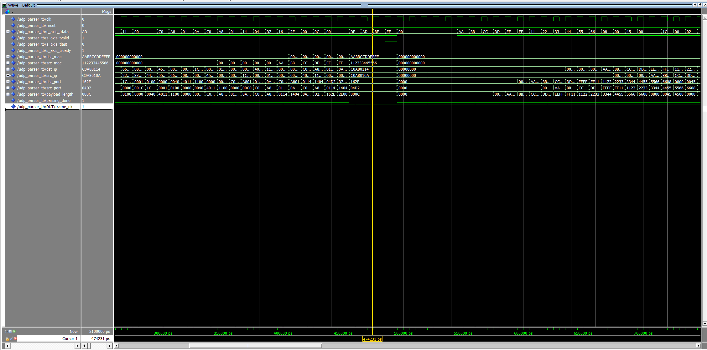
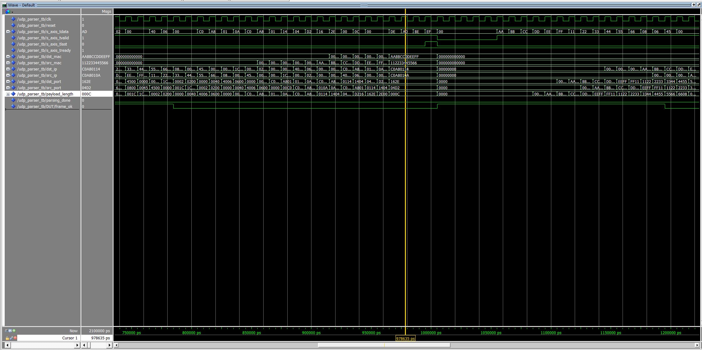
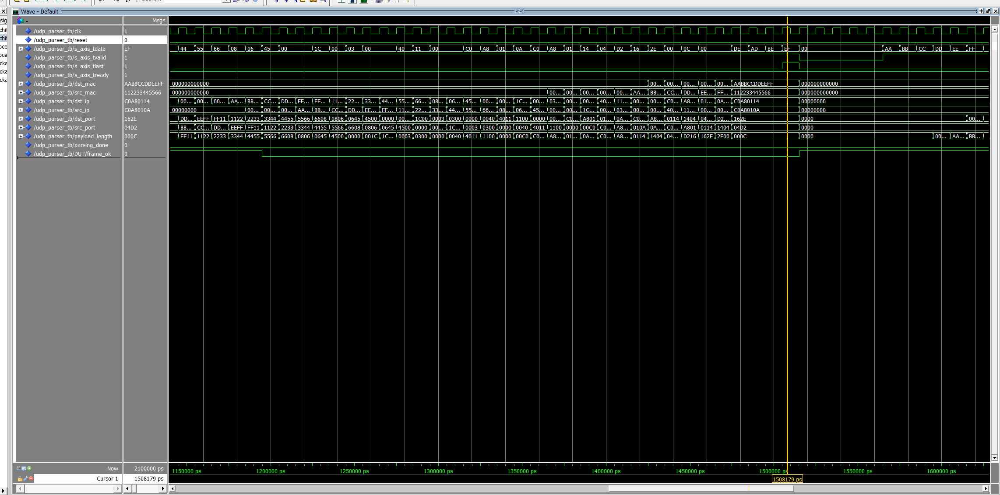
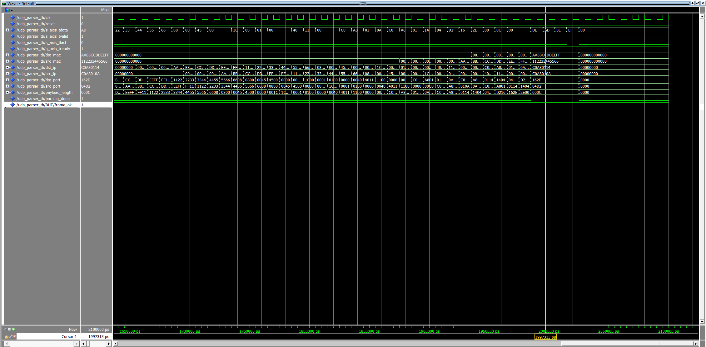

# UDP Parser — VHDL

An AXI-Stream UDP/IPv4 header parser written in VHDL. It receives raw Ethernet frames byte by byte and extracts the MAC addresses, IP addresses, UDP ports, and payload length as soon as the 42-byte header has been received.

## Features

- AXI-Stream slave interface (byte-wide, `TDATA`, `TVALID`, `TLAST`, `TREADY`)
- Parses Ethernet + IPv4 + UDP headers (42 bytes total)
- Validates EtherType (`0x0800` — IPv4) and IP protocol (`0x11` — UDP)
- Silently discards non-IPv4 or non-UDP frames
- Single-cycle `parsing_done` pulse when a valid header is fully captured
- Fully synchronous, reset-able design

## Port Description

| Port | Direction | Width | Description |
|---|---|---|---|
| `clk` | in | 1 | Clock |
| `reset` | in | 1 | Synchronous active-high reset |
| `s_axis_tdata` | in | 8 | AXI-Stream input byte |
| `s_axis_tvalid` | in | 1 | Input byte valid |
| `s_axis_tlast` | in | 1 | End of frame |
| `s_axis_tready` | out | 1 | Always asserted (back-pressure not supported) |
| `dst_mac` | out | 48 | Destination MAC address |
| `src_mac` | out | 48 | Source MAC address |
| `dst_ip` | out | 32 | Destination IP address |
| `src_ip` | out | 32 | Source IP address |
| `dst_port` | out | 16 | Destination UDP port |
| `src_port` | out | 16 | Source UDP port |
| `payload_length` | out | 16 | UDP payload length (from UDP header) |
| `parsing_done` | out | 1 | Pulses high for one cycle when header is valid and ready |

## How It Works

The parser uses a 42-stage shift register (`shreg`) that shifts in one byte per valid clock cycle. A companion shift register (`valid_pipe`) tracks how many valid bytes have passed through.

- When `valid_pipe(41)` goes high, all 42 header bytes are in `shreg` and the header fields are driven directly from fixed tap positions.
- Two inline checks abort the frame early: EtherType at byte 13 must be `0x0800`, and IP Protocol at byte 23 must be `0x11`. If either fails, `frame_ok` is cleared and `parsing_done` is suppressed.
- `tlast` resets the pipeline so the next frame starts clean.

## Frame Layout Reference

```
Bytes  0–5   Destination MAC
Bytes  6–11  Source MAC
Bytes 12–13  EtherType (must be 0x0800)
Bytes 14–33  IPv4 header (20 bytes)
  Byte 23    Protocol (must be 0x11 for UDP)
  Bytes 26–29 Source IP
  Bytes 30–33 Destination IP
Bytes 34–41  UDP header (8 bytes)
  Bytes 34–35 Source port
  Bytes 36–37 Destination port
  Bytes 38–39 UDP length
```

## Simulation

The testbench (`udp_parser_tb.vhd`) sends three packet types back-to-back and verifies the parser behaviour in each case.

| Test | Input | Expected result |
|------|-------|-----------------|
| Valid UDP | EtherType `0x0800`, Protocol `0x11` | `parsing_done` pulses; all header fields decoded |
| TCP frame | Protocol `0x06` | `frame_ok` cleared; `parsing_done` never fires |
| ARP frame | EtherType `0x0806` | `frame_ok` cleared at byte 13; `parsing_done` never fires |
| UDP after ARP | Valid UDP following an ARP discard | Parser resets cleanly; `parsing_done` fires normally |

### Valid UDP — header fields extracted



### TCP packet — silently discarded



### ARP packet — silently discarded



### UDP after ARP — clean pipeline recovery



## Running the Testbench

Requires ModelSim or QuestaSim. Run from the project root:

```tcl
vlib work
vcom udp_parser.vhd udp_parser_tb.vhd
vsim udp_parser_tb
do sim/wave.do
run -all
```

The `sim/wave.do` script pre-configures the waveform window with all AXI-Stream signals, the internal shift register (`shreg`), `valid_pipe`, `frame_ok`, and all parsed output fields — all displayed in hexadecimal.

## License

MIT
